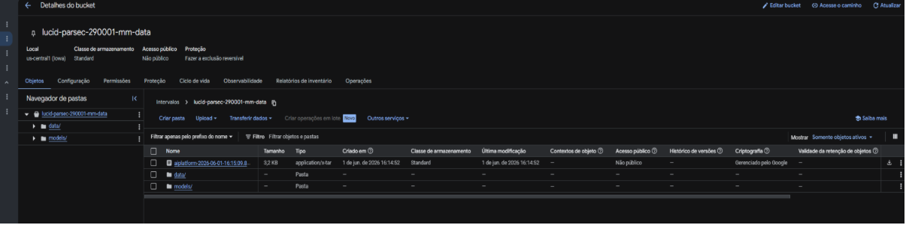
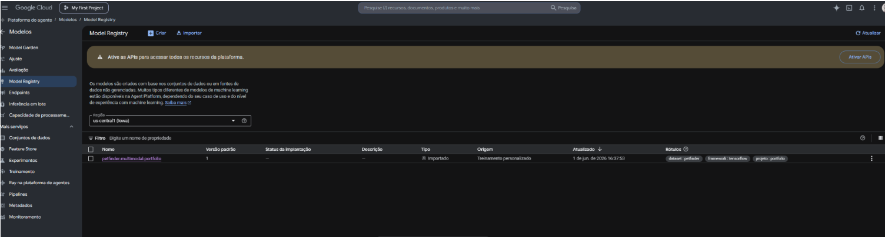
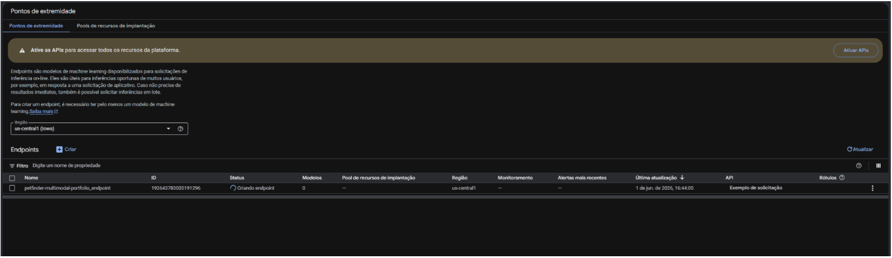
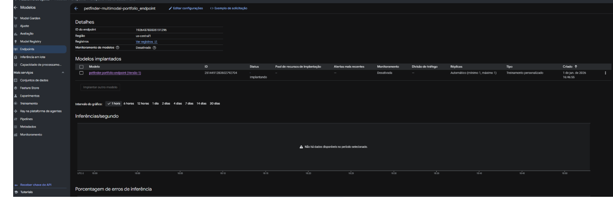
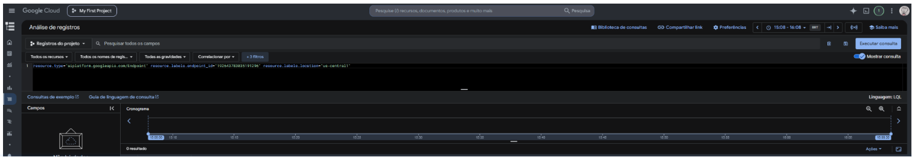

# Multimodal ML Pipeline — Vertex AI + TensorFlow + BigQuery

> **Pipeline completa de Machine Learning multimodal** com deploy em produção no Google Cloud Platform.
> Combina visão computacional (imagens) + dados tabulares em um único modelo de deep learning,
> registrado e servido via Vertex AI Endpoints.

<!-- ATS KEYWORDS: Machine Learning Engineer, MLOps, TensorFlow, Google Cloud Platform, Vertex AI,
BigQuery, Python, Deep Learning, Computer Vision, Data Engineering, Scikit-learn, Pandas,
Cloud Storage, Model Registry, CI/CD, Pipeline, Transfer Learning, Fine-tuning, REST API -->


---

## Sumário Executivo

Este projeto demonstra a construção e operação de uma **pipeline de ML de ponta a ponta** no ecossistema Google Cloud, cobrindo as responsabilidades centrais de um **ML Engineer / MLOps Engineer**:

- Ingestão e pré-processamento de dados multimodais (imagem + tabular)
- Design e treino de modelo deep learning com transfer learning e fine-tuning
- Registro, versionamento e deploy de modelo em produção (Vertex AI)
- Armazenamento e gestão de artefatos em Cloud Storage
- Observabilidade com Cloud Logging

**Dataset:** PetFinder Adoption Prediction (Kaggle) — 14.000 registros, 58.000 imagens  
**Objetivo:** Prever velocidade de adoção de animais (5 classes)  
**Resultado:** Modelo multimodal treinado, registrado e servido via endpoint REST em produção

---

## Competências Demonstradas

### Machine Learning & Deep Learning
- Arquitetura multimodal: fusão de features de imagem (CNN) + features tabulares (Dense)
- Transfer learning com **MobileNetV2** pré-treinado em ImageNet
- Fine-tuning seletivo de camadas (`FINE_TUNE_AT = 124`)
- Data augmentation: flip, rotação, zoom, brilho
- Regularização: Dropout, BatchNormalization
- Callbacks: EarlyStopping, ReduceLROnPlateau

### MLOps & Infraestrutura Google Cloud
- **Vertex AI Model Registry:** registro, versionamento e labels de modelos
- **Vertex AI Endpoints:** deploy de modelo como API REST em produção
- **Cloud Storage:** armazenamento de dataset, modelos e artefatos de treino
- **IAM & Service Accounts:** configuração de permissões granulares
- **Cloud Logging:** observabilidade e monitoramento de inferências

### Engenharia de Dados
- Pipeline de ingestão via **Kaggle API**
- Pré-processamento: normalização (StandardScaler), encoding categórico, tratamento de nulos
- Indexação O(1) para vínculo de 14k registros com 58k imagens
- Integração com **BigQuery** (estrutura preparada)

### Boas Práticas de Engenharia
- Zero hardcode: toda configuração via `.env` / variáveis de ambiente
- Logging estruturado com módulo `logging` (sem `print()`)
- Versionamento semântico (`MAJOR.MINOR.PATCH`) com histórico no módulo
- Separação de responsabilidades: `data/`, `models/`, `trainer/`
- `.gitignore` protegendo credenciais, dados e modelos grandes

---

## Arquitetura do Modelo

```
┌─────────────────────────────────────────────────────────────────┐
│                    ENTRADA MULTIMODAL                           │
├──────────────────────────┬──────────────────────────────────────┤
│   Imagem (224 × 224 × 3) │   Features Tabulares (19 features)  │
│                          │   Idade, Raça, Saúde, Cor, etc.     │
├──────────────────────────┼──────────────────────────────────────┤
│   [Data Augmentation]    │                                      │
│   flip | rotação | zoom  │   [Dense(64)]                       │
│                          │   [BatchNormalization]               │
│   [MobileNetV2]          │   [Dense(32)]                       │
│   2.2M params            │                                      │
│   frozen: camadas 0-124  │                                      │
│   trainable: 124-154     │                                      │
│                          │                                      │
│   [GlobalAveragePool2D]  │                                      │
│   [Dense(128)]           │                                      │
│   [Dropout(0.3)]         │                                      │
├──────────────────────────┴──────────────────────────────────────┤
│                    [Concatenate]  → 160 features               │
│                    [Dense(64)]                                  │
│                    [Dropout(0.3)]                               │
│                    [Dense(5, softmax)]                          │
├─────────────────────────────────────────────────────────────────┤
│              SAÍDA: AdoptionSpeed (classes 0 a 4)               │
│   0: mesmo dia │ 1: 1 semana │ 2: 1 mês │ 3: 3 meses │ 4: nunca│
└─────────────────────────────────────────────────────────────────┘

Parâmetros treináveis:    177.957
Parâmetros não-treináveis: 2.257.984 (backbone congelado)
Total:                    2.435.941
```

---

## Pipeline Completa

```
FASE 1 — Ingestão
  └── Kaggle API → download dataset PetFinder (1.5GB)
  └── 14.000 registros CSV + 58.000 imagens JPG

FASE 2 — Pré-processamento
  └── Tratamento de nulos (Name, Description)
  └── Encoding de 12 features categóricas
  └── Normalização de 5 features numéricas (StandardScaler)
  └── Indexação O(1): vínculo PetID → image_path (58k arquivos)
  └── Output: train_14k.csv (13.684 registros com imagem)

FASE 3 — Treino Local
  └── Arquitetura multimodal (models/multimodal_model.py)
  └── Data augmentation + fine-tuning MobileNetV2
  └── EarlyStopping + ReduceLROnPlateau
  └── Output: petfinder_multimodal_portfolio.keras

FASE 4 — Cloud Storage (Google Cloud)
  └── Upload dataset → gs://bucket/data/
  └── Export SavedModel → gs://bucket/models/portfolio/
  └── Custo: ~$0.03/mês para 1.5GB

FASE 5 — Vertex AI
  └── Model Registry: registro com labels e versionamento
  └── Endpoint: deploy em n1-standard-2 (REST API)
  └── Cloud Logging: observabilidade em tempo real
  └── Cleanup: undeploy após validação (custo ~$0.10 total)
```

---

## Evidências de Produção

### 1. Cloud Storage — Dataset e modelo armazenados na nuvem
> Bucket `lucid-parsec-290001-mm-data` em `us-central1` com pastas organizadas:
> `data/` (dataset) e `models/` (artefatos do modelo)



---

### 2. Vertex AI Model Registry — Modelo registrado com versionamento
> Modelo `petfinder-multimodal-portfolio` registrado como Versão 1 com labels
> `dataset:petfinder`, `framework:tensorflow`, `projeto:portfolio`.
> Origem: Treinamento personalizado.



---

### 3. Vertex AI Endpoints — Deploy em produção
> Endpoint `petfinder-multimodal-portfolio_endpoint` criado na região `us-central1`
> com ID real `192643783035191296`. Status: provisionando VM n1-standard-2.



---

### 4. Vertex AI Endpoint — Detalhes e métricas de inferência
> Modelo implantado com réplica automática (mín. 1, máx. 1). Dashboard com gráfico
> de `Inferências/segundo` e `Porcentagem de erros` em tempo real.



---

### 5. Cloud Logging — Observabilidade do endpoint
> Logs do endpoint filtrados por `endpoint_id` via LQL (Logging Query Language).
> Integração nativa com o Cloud Logging do Google Cloud.



---

## Estrutura do Repositório

```
vertex-multimodal/
│
├── data/
│   ├── download_petfinder.py   # Ingestão via Kaggle API com tratamento de erros
│   └── preprocess.py           # Pré-proc. tabular + vínculo imagem↔registro (O(1))
│
├── models/
│   └── multimodal_model.py     # Arquitetura: MobileNetV2 + tabular + augmentation
│
├── trainer/
│   └── train_vertex.py         # Script de treino para Vertex AI Custom Training Job
│
├── train.py                    # Treino local com tf.data pipeline otimizado
├── deploy_vertex.py            # Registro no Model Registry + deploy de endpoint
├── submit_job.py               # Submissão de Custom Training Job (GPU T4)
├── gcp_setup_test.py           # Validação de conectividade: Vertex AI + Storage + BQ
│
├── docs/screenshots/           # Evidências de execução em produção
├── requirements.txt
├── .env.example
└── CLAUDE.md
```

---

## Como Executar

```bash
# 1. Ambiente virtual
python -m venv .venv
.\.venv\Scripts\Activate.ps1
pip install -r requirements.txt

# 2. Credenciais
cp .env.example .env
# Preencher: GCP_PROJECT, GCP_REGION, GCP_BUCKET, GOOGLE_APPLICATION_CREDENTIALS

# 3. Kaggle API
# Baixar kaggle.json em kaggle.com/settings → Legacy API Credentials
# Salvar em C:\Users\usuario\.kaggle\kaggle.json

# 4. Pipeline completa
py data/download_petfinder.py   # Download dataset
py data/preprocess.py           # Pré-processamento
py train.py                     # Treino local
py deploy_vertex.py             # Deploy no Vertex AI
```

---

## Tecnologias

`Python 3.11` · `TensorFlow 2.21` · `Keras` · `MobileNetV2` · `Scikit-learn` · `Pandas`
`Google Cloud Platform` · `Vertex AI` · `Cloud Storage` · `BigQuery` · `Cloud Logging`
`Kaggle API` · `REST API` · `IAM` · `Service Accounts` · `Git` · `GitHub`

---

## Autor

**Leonardo** — ML Engineer | Data Engineer | Google Cloud  
[](https://linkedin.com/in/leonardod38)
[](https://github.com/leonardod38)
